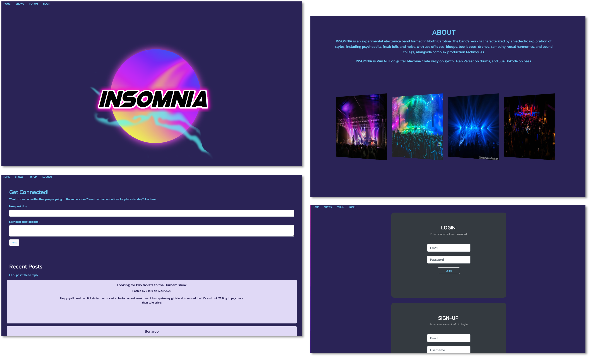

# INSOMNIA's Band Website

## Table of Contents

- [Description](#description)
- [Usage](#usage)
- [Launch](#launch)
- [Technology](#technology)
- [Testing](#testing)
- [Contributions](#contributions)
- [Questions](#questions)
- [License](#license)

## Description

INSOMNIA is our tech-inspired, fictional electronica band.
We designed INSOMNIA’s website to be different from other band websites:

- We wanted the site’s animation to reflect the music’s energy
- The color scheme to mimic the look and feel of being at a show
- And for the site to feel like an exclusive experience for fans.

Once a superfan signs up and logs in, they have access to exclusive content. They can interact with other fans in the forum, as well as with the band! Being a music fan is a unique experience, but one that you want to share with your community. Our design helps bring fans together to support INSOMNIA’s music. As music fans, we wanted to create a band page that was interactive, fun to visit, and has an exclusive look and feel.

## Usage :notes:

When you arrive at the [homepage](https://band-site-22.herokuapp.com/), you can:

- Sign up and log in to the fan forum
- Connect with the band and other fans
- View upcoming shows
- Learn about the band

## Launch :rocket:

[Click to visit our deployed website on Heroku](https://band-site-22.herokuapp.com/)
[Link to our project presentation on Google Drive](https://docs.google.com/presentation/d/1sz1r8w69iuxA5GcQ9Kud4IQO5vSZ1rkEvmK0uFJQBdY/edit?usp=sharing)

## Technology

This application was built with the help of the following languages, technology, and applications:

- JavaScript
- Node.js
- HTML / Handlebars
- CSS
- MySQL
- Express
- GreenSock GSAP JavaScript animation
- npm packages (e.g., Sequelize)
- Heroku
- JawsDB

## Testing

Testing was performed via the Insomnia application.

## Contributions

Thank you to everyone on the team for your contributions!

- [Olivia](https://github.com/olivelliott)
- [Donnie](https://github.com/Atlas075)
- [Keon](https://github.com/jkmebane)
- [Caren](https://github.com/cammeer)

## Questions?

Contact us with any questions at: [caren@merzhaus.org](caren@merzhaus.org)

## License

Copyright © 2022 [Olivia Elliott](https://github.com/olivelliott).  
This project is [MIT](https://github.com/olivelliott/next-progress-bar/blob/main/LICENSE) licensed.
